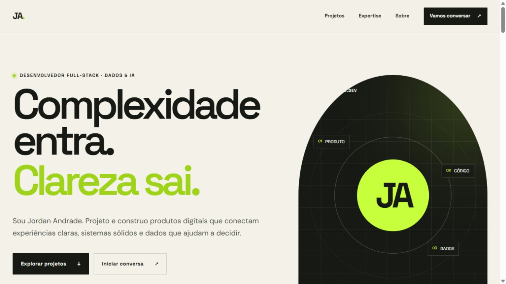
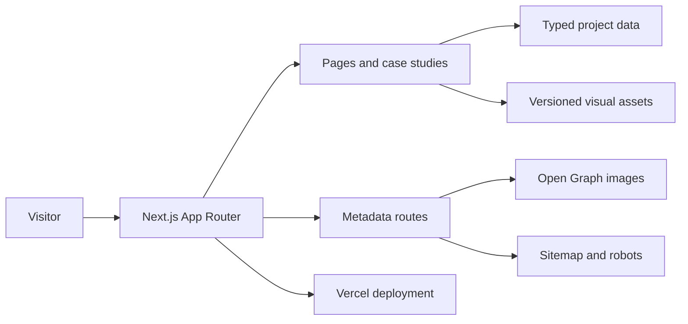

# Jordan Andrade — Portfolio

[](https://github.com/jord-andrade/portfolio/actions/workflows/ci.yml)
[](https://jord-andrade.dev)
[](LICENSE)



A personal, product-focused portfolio for selected work across full-stack
engineering, data and AI. The interface is available in Portuguese and English;
the repository documentation remains in English so the implementation is easy
to evaluate internationally.

[Live site](https://jord-andrade.dev) · [Selected work](https://jord-andrade.dev/#projetos) · [GitHub profile](https://github.com/jord-andrade)

## What this repository demonstrates

- a responsive, accessible interface built with the Next.js App Router;
- typed, content-driven case studies without an external CMS;
- localized home and case-study routes in Portuguese and English;
- evidence blocks that distinguish public outcomes from work in development;
- first-party metadata, Open Graph images, sitemap and robots routes;
- a small dependency surface and a reproducible production build;
- automated checks for linting, types, public content and the build itself.

## Architecture



Project content lives in [`app/data/projects.ts`](app/data/projects.ts). Shared
components render that content into the home page and individual case-study
routes. This keeps editorial updates reviewable in Git while avoiding a CMS for
a deliberately small site.

## Run locally

Requirements:

- Node.js 24;
- npm 11 or a version compatible with the committed lockfile.

```bash
git clone https://github.com/jord-andrade/portfolio.git
cd portfolio
npm ci
npm run dev
```

Open <http://localhost:3000>.

To make WhatsApp the primary contact channel, copy `.env.example` to `.env.local`
and set `NEXT_PUBLIC_WHATSAPP_NUMBER` to digits only, including the country code.
Without this value, the interface explicitly falls back to email.

## Quality checks

```bash
npm test
npm run lint
npm run typecheck
npm run build
```

`npm run check` runs the same verification sequence used by CI. Pull requests
and pushes to `main` are checked on GitHub Actions.

## Project structure

```text
app/
├── components/          reusable interface components
├── data/                typed project content
├── projetos/[slug]/     Portuguese case-study pages
├── en/                  English home and case-study pages
├── opengraph-image.tsx  generated social image
├── robots.ts            crawler policy
└── sitemap.ts           canonical public routes
public/                  versioned case-study assets
tests/                   public-contract checks
```

## Decisions and limitations

- The site is statically content-driven because its update frequency does not
  justify the operational cost of a CMS.
- Case studies distinguish shipped products from work in development; the site
  does not present future demos as available.
- The portfolio describes product decisions and public-safe outcomes. Private
  source code, customer information and operational datasets are intentionally
  excluded.
- The site keeps public-product evidence separate from in-development claims;
  no adoption or business-impact metric is presented without a source.

## Security and responsible disclosure

Do not open a public issue with credentials, private data or vulnerability
details. Follow the private reporting guidance in [SECURITY.md](SECURITY.md).

## License

The source code is available under the [MIT License](LICENSE). Visual assets and
case-study content remain attributable to Jordan Andrade unless their source is
stated otherwise.
